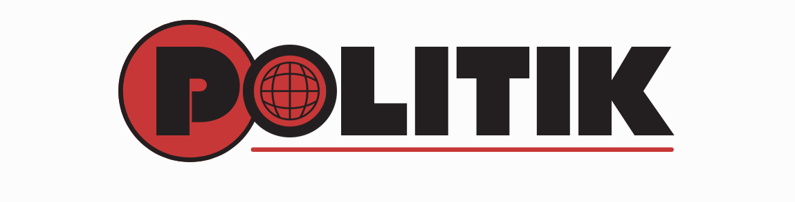

# POLITIK - Highlighting Corruption




The **POLITIK** Extension is a browser extension designed to highlight and provide descriptions for the names of specific Spanish political parties that are listed in a predefined database. The extension scans the content of web pages, identifies the names of these parties, and highlights them. When users hover over the highlighted names, a tooltip appears displaying a description associated with the party.

## Features

- ```Dynamic Highlighting```: The extension dynamically scans and highlights the names of political parties listed in the database.

- ```Tooltip Descriptions```: When users hover over a highlighted name, a tooltip appears with a description of the  party.

- ```Real-Time Updates```: The extension uses a MutationObserver to monitor changes in the DOM, ensuring that any dynamically loaded content is also scanned and highligh

- ```Daily Corruption Counter```: Tracks and displays the number of corrupt political parties encountered during navigation, providing users with a daily count.

https://github.com/user-attachments/assets/da4fed77-e269-4885-9a17-1299c6096500


## Contributing

Contributions are welcome! If you have any suggestions or improvements, please open an issue or submit a pull request.

## Disclaimer

This extension is intended for educational and informational purposes only. The descriptions provided in the database are for illustrative purposes and do not reflect the views of the author or contributors


